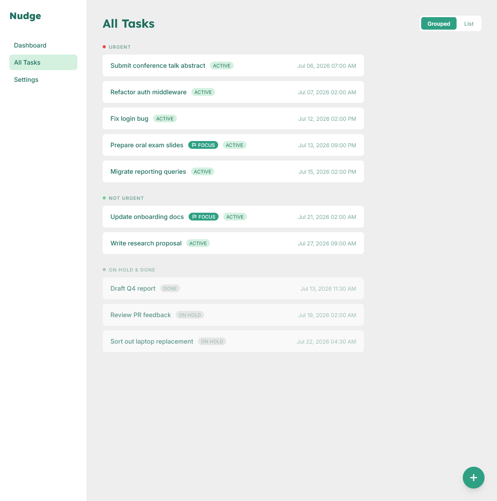
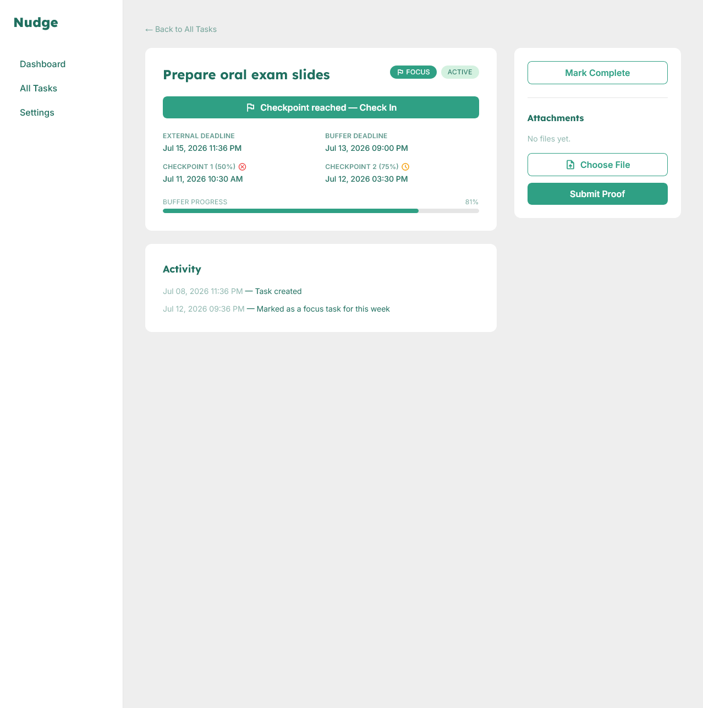
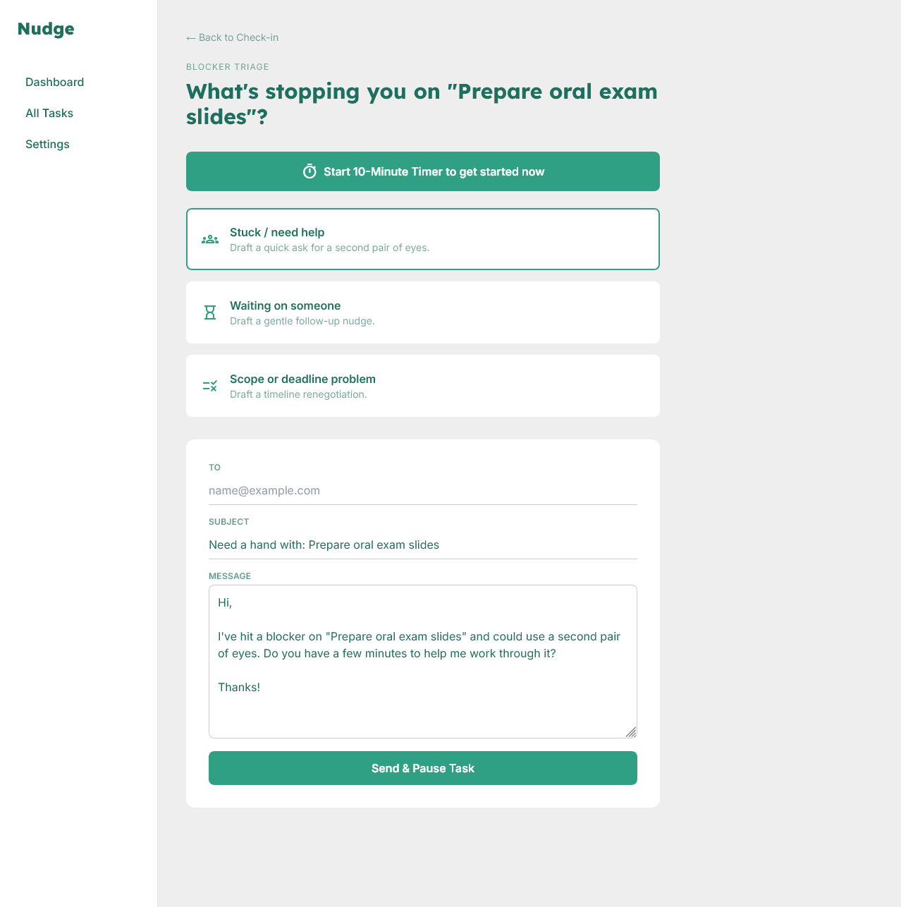

# Nudge

> A supportive, deadline-aware task manager that turns task dumps into manageable next steps.

Nudge is a single-user productivity tool designed to reduce the friction around deadlines. Add a task with a real deadline and Nudge calculates a buffer deadline and check-in points. When a check-in is due, the user can submit proof of progress or choose a blocker; the blocker flow prepares an appropriate message draft to help move the task forward.

This project is being built as a university assignment. It consists of a working core application and a separately runnable notification worker, demonstrating communication between two independent processes.

## The idea

Many task tools leave prioritisation and follow-through entirely to the user. Nudge aims to provide a gentle intervention loop:

1. Capture a task with its external deadline.
2. Calculate a buffer deadline plus 50% and 75% checkpoints.
3. At a checkpoint, prompt for progress proof or a reason the task is blocked.
4. Use the chosen blocker to prepare a help request, follow-up, or extension message.
5. Let the user send the message in their normal mail application and continue.

The goal is not to create pressure through dashboards full of statistics. Nudge should make the next useful action clear while keeping the interface calm, clean, and lightweight.

## Current MVP

The current implementation includes:

- Flask/Jinja core application for creating and viewing tasks.
- Automatic buffer-deadline and checkpoint calculation, with API support for overriding the calculated dates.
- Dashboard, all-tasks view, task detail, check-in, triage, focus timer, and settings screens.
- Progress-proof uploads and task activity history.
- A four-option blocker triage flow with editable `mailto:` message drafts and on-hold task status.
- A separate notification worker that polls the core app over REST, sends review emails, parses referenced replies with rules, and writes weekly focus priorities back to the app.
- Urgency filtering, configurable thresholds, and optional accountability-buddy alerts for seriously overdue active tasks.

The scoped requirements and their completion status live in [docs/03-mvp-requirements-checklist.md](docs/03-mvp-requirements-checklist.md).

## Screenshots

**All Tasks** — grouped into Urgent, Not Urgent, and On Hold & Done, with a List view toggle.



**Single Task** — checkpoint dates with an at-a-glance check-in status (missed, grace period, or checked in).



**Blocker Triage** — a pre-filled, editable message draft after choosing a blocker reason, sent via the user's own mail client.



More screens (Dashboard, Settings, the triage reason picker) are in [screenshots/](screenshots/).

## Planned and upcoming work

The backlog contains intentionally deferred ideas rather than unfinished MVP work. Notable next steps include:

- Bundled daily checkpoint reminders for committed focus tasks.
- An optional early re-prioritisation flow when all focus tasks are complete.
- Better all-tasks sorting and grouping.
- Lightweight list/project tags and deadline-free backlog items.
- A local AI-assisted reply parser (via Ollama) as a third independent process; it would complement, not replace, the current rule-based parser.
- Time-zone support, optional Docker packaging, and other portfolio polish.

See [docs/backlog.md](docs/backlog.md) for the full rationale behind each deferred item.

## Project structure

```text
nudge/
├── core-app/                 Flask application (Part B)
│   ├── app.py                Routes, pages, and REST API
│   ├── models.py             Task, checkpoint, settings, and priority logic
│   ├── db.py                 SQLite database setup
│   ├── uploads.py            Attachment handling
│   └── templates/            Jinja page templates
├── notification-worker/      Independent Python worker (Part C)
│   ├── worker.py             REST polling, review mail, reply parsing, alerts
│   └── requirements.txt      Worker dependencies (currently standard library only)
├── design-reference/         Google Stitch exports and visual inspiration
├── docs/                     Requirements, build decisions, and test notes
│   └── GenAI/                Exported AI conversations, Stitch prompts, and workflow history
├── screenshots/              Screens of the finished app
└── README.md                 This overview
```

## Architecture

Nudge runs as two independent processes:

```text
Core app (Flask + SQLite)  <-- REST polling and updates -->  Notification worker (Python)
                                                                  |
                                                                  v
                                                        Mailpit / email for local testing
```

The worker can keep running if the core app or local mail catcher is unavailable, logging the error and retrying on its next cycle. No Docker setup is required for the current version.

For local setup and a complete manual test walkthrough, see [docs/how-to-run-and-test-locally.md](docs/how-to-run-and-test-locally.md).

## Google Stitch design history

Nudge began with two Google Stitch explorations. The first established the supportive check-in and triage direction, but the overall visual direction became too "Zen" and removed useful deadline context. The second iteration, **Nudge – Smart Deadline Manager**, supplied most of the design language later used in the project.

| Exploration | Notes | Google Stitch project |
| --- | --- | --- |
| **Nudge – Stress-Free Task Manager** | First attempt; calm, spacious, but too Zen for a deadline-focused tool. | [Open design](https://stitch.withgoogle.com/projects/17382071208739700646) |
| **Nudge – Smart Deadline Manager** | Second attempt; more practical deadline and task-management direction. Most later design work is based on this exploration. | [Open design](https://stitch.withgoogle.com/projects/5642606155166097092) |

The exported screens and HTML references are preserved under `design-reference/google_stitch/`. They are source material rather than a one-to-one specification; the app combines and adapts the strongest parts of those designs for the actual MVP scope.

Noted: Throughout the design process Google Stitch visually added features expected in generic SaaS products, such as membership tiers, collaboration functionality, inbox- and draft-system, and many more. It was imperative to cohere with the product scope to avoid feature creep.

## Scope boundaries

To keep the project explainable and focused, the MVP deliberately does not include multi-user collaboration, task ownership, an in-app inbox/drafts data model, AI processing, or direct access to a user's personal mail account for blocker messages. Blocker drafts use the user's standard mail client; the worker's local testing email flow is a separate system-to-user channel.

## Documentation

- [Kickoff briefing](docs/00-kickoff-briefing.md) — project goals, constraints, architecture, and implementation sequence.
- [MVP requirements checklist](docs/03-mvp-requirements-checklist.md) — traceable scope and progress.
- [Local run and test guide](docs/how-to-run-and-test-locally.md) — start the app, worker, and Mailpit.
- [Backlog](docs/backlog.md) — consciously postponed work and reasons.
- Numbered files in [docs/](docs/) — implementation decisions documented step by step.

